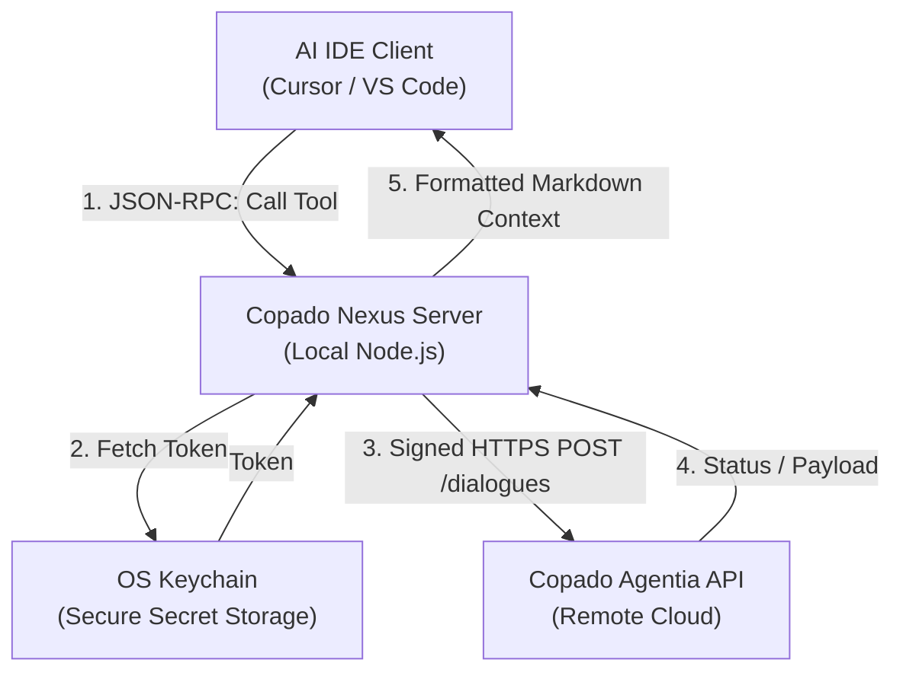
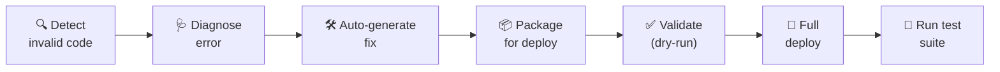

[](https://mseep.ai/app/shibprakash-copado-nexus)

<p align="center">
  
  
  
  
  
</p>

<h1 align="center">🚀 Copado Nexus</h1>

<p align="center">
  <strong>Autonomous Salesforce DevOps orchestration directly from your IDE.</strong><br>
  <em>Copado Nexus is an MCP server integrating Copado's Agentia AI agents (Plan, Build, Test, Operate) to eliminate browser context-switching and enable self-healing CI/CD pipelines.</em>
</p>

---

## 📋 Table of Contents

- [The Problem](#-the-problem)
- [The Solution](#-the-solution)
- [Architecture](#-architecture)
- [Features](#-features)
- [Quick Start](#-quick-start)
- [Project Structure](#-project-structure)
- [MCP Tools Reference](#-mcp-tools-reference)
- [Salesforce Components](#-salesforce-components)
- [Security](#-security)
- [Scripts](#-scripts)
- [The Golden Path](#-the-golden-path)
- [Contributing](#-contributing)
- [License](#-license)

---

## 🔥 The Problem

Salesforce developers face **extreme cognitive friction** due to constant context-switching between their local IDE and the Copado browser UI to track user stories, trigger tests, validate metadata, and debug pipeline failures. Traditional CLIs simply shift the manual labor from the browser to the terminal.

## 💡 The Solution

Copado Nexus **eliminates the Copado UI entirely** for day-to-day engineering workflows. It exposes the specialized agents of Copado's **Agentia AI Context Hub** directly as discoverable, executable tools inside any AI-native IDE (Cursor, VS Code, etc.).

**Key outcomes:**
- 🏎️ **30 seconds** average deployment loop (down from 4.5 minutes)
- 🖥️ **100% browser-free** build/test/verify cycles
- 🔄 **Self-healing pipeline** — errors auto-route to the Operate Agent for autonomous diagnosis

---

## 🏗️ Architecture



---

## ✨ Features

### 🌉 Context Bridge (Zero-Configuration Workspace Mapping)
Automatically detects your active workspace by reading the current git branch, parsing the Copado story ID (e.g., `US-8888`), and mapping it to the corresponding Copado workspace — no manual configuration required.

### 🤖 Native Agentia Tool Registration
Core tools registered via the MCP SDK, directly invocable by any LLM:

| Tool | Agent | Purpose |
|------|-------|---------|
| `copado_plan_story` | Plan | Refine user story scope and acceptance criteria |
| `copado_build_package` | Build | Validate or deploy metadata components to the pipeline |
| `copado_run_test` | Test | Execute robotic test suites in target environments |

### 🔧 Self-Healing Pipeline Feedback Loop
When a pipeline failure occurs, the server **automatically** intercepts the error, routes the stack trace to the **Operate Agent**, and returns human-readable mitigation instructions directly into your IDE — no manual debugging required.

### 🛡️ Zero-Trust Security
All Copado API tokens are stored exclusively in the **native OS credential manager** (Windows Credential Manager / macOS Keychain / Linux libsecret) via `keytar`. No `.env` files. No plaintext secrets.

---

## ⚡ Quick Start

### Prerequisites

- **Node.js** ≥ 18
- **Git**
- **Copado Account** with API access
- **AI-native IDE** — [Cursor](https://cursor.com) or VS Code with Copilot

### 1. Clone the Repository

```bash
git clone https://github.com/ShibPrakash/COPADO-NEXUS.git
cd COPADO-NEXUS
```

### 2. Install Dependencies

```bash
npm install
```

### 3. Store Your Copado API Token

```bash
node scripts/set-token.mjs <YOUR_COPADO_API_TOKEN>
```

> Your token is stored securely in the OS keychain under service `CopadoNexusDevOps`. Run `node scripts/set-token.mjs --check` to verify.

### 4. Build the MCP Server

```bash
npm run build
```

### 5. Configure Your IDE

The MCP server is registered in `.cursor/mcp.json` (already pre-configured). If you need to adjust paths:

```json
{
  "mcpServers": {
    "copado-nexus-production": {
      "command": "node",
      "args": ["<PROJECT_ROOT>/dist/index.js"],
      "cwd": "<PROJECT_ROOT>",
      "env": {
        "NODE_ENV": "production",
        "COPADO_API_VERSION": "2026.1",
        "COPADO_API_BASE_URL": "https://copadogpt-api.robotic.copado.com",
        "COPADO_ORG_ID": "<YOUR_ORG_ID>"
      }
    }
  }
}
```

### 6. Start Using

Open your IDE and prompt:

```text
"Deploy my current branch changes to the pipeline."
```

The AI agent will discover and call `copado_build_package` autonomously. ✨

---

## 📁 Project Structure

```text
copado-nexus/
├── .cursor/mcp.json              # MCP server registration for Cursor IDE
├── force-app/                    # Salesforce Apex components
│   └── main/default/classes/
│       ├── ForceMentorScoring.cls           # Lead mentor scoring engine
│       ├── ForceMentorScoringTest.cls       # Unit tests for scoring engine
│       └── IntilligenceTesting.cls          # Intelligence validation test suite
├── manifest/package.xml          # Salesforce deployment manifest
├── scripts/                      # Utility scripts (token setup, testing)
├── src/                          # TypeScript source code
│   ├── api/                      # Copado Agentia API client & error routing
│   ├── git/                      # Git context resolution
│   ├── utils/                    # Terminal UI loggers
│   └── index.ts                  # MCP server entry point
├── package.json                  # Node.js project config
└── sfdx-project.json             # Salesforce DX project config
```

---

## 🔧 MCP Tools Reference

### `copado_plan_story`
Invoke the Plan Agent to refine user story scope, acceptance criteria, and implementation guidance.

| Parameter | Type | Required | Description |
|-----------|------|----------|-------------|
| `storyId` | `string` | ✅ | Copado user story ID (e.g., `US-8888`) |
| `userPrompt` | `string` | ✅ | Descriptive instructions (min 10 chars) |

### `copado_build_package`
Deploy or validate metadata components against the Copado pipeline via the Build Agent.

| Parameter | Type | Required | Default | Description |
|-----------|------|----------|---------|-------------|
| `storyId` | `string` | ✅ | — | Copado user story ID |
| `metadataComponents` | `string[]` | ✅ | — | Components to deploy (e.g., `ApexClass/MyClass`) |
| `validateOnly` | `boolean` | ❌ | `true` | If true, validates without deploying |

### `copado_run_test`
Execute a robotic test suite in the target Salesforce environment via the Test Agent.

| Parameter | Type | Required | Description |
|-----------|------|----------|-------------|
| `workspaceId` | `string` | ✅ | Copado workspace/org ID |
| `testSuiteId` | `string` | ✅ | Test suite or class to execute |
| `executionEnvironment` | `enum` | ✅ | `Sandbox` \| `ScratchOrg` \| `UAT` \| `Production` |

---

## 🏆 The Golden Path

The **Golden Path** is the core demo flow for Copado Nexus:



1. Developer writes an invalid Apex class locally.
2. Developer prompts: *"Deploy my current branch changes to the pipeline"*
3. IDE agent discovers `copado_build_package` and calls it via MCP.
4. On failure → Operate Agent auto-diagnoses and suggests fix.
5. On success → Test Agent validates with automated test suite.

---

## 🤝 Contributing

We welcome contributions! Please see [CONTRIBUTING.md](CONTRIBUTING.md) for guidelines on how to proceed.

## 📄 License

This project is licensed under the MIT License — see the [LICENSE](LICENSE) file for details.

---

<p align="center">
  Built with 💙 for the <strong>Copado Hackathon 2026</strong>
</p>
